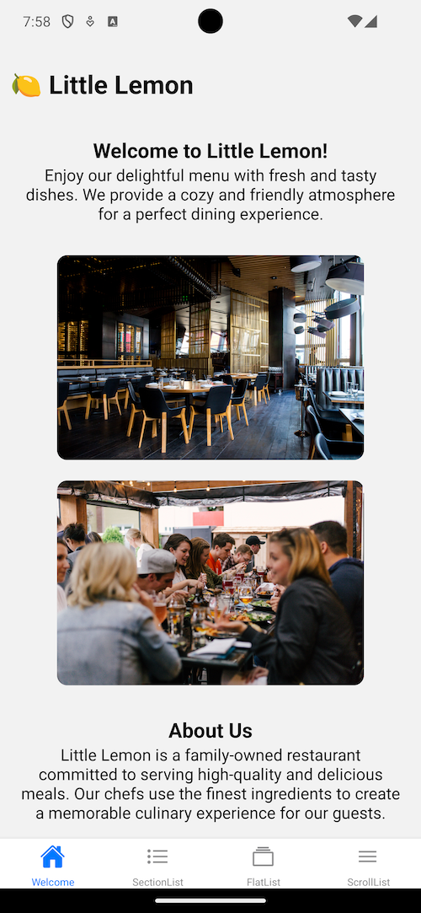
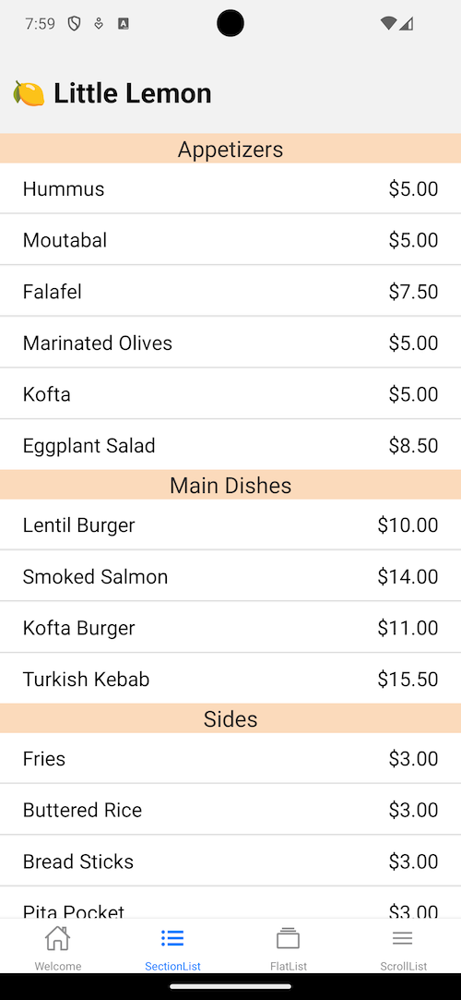
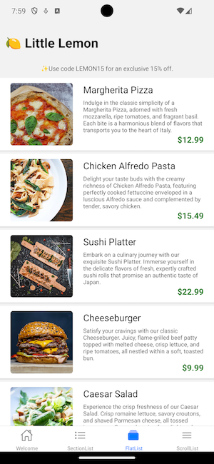

# Little Lemon Restaurant App - React Native

Welcome to the Little Lemon Restaurant App, a delightful React Native application showcasing the use of the FlatList component for a seamless and efficient list display.

## Table of Contents

- [Introduction](#introduction)
- [Features](#features)
- [Installation](#installation)
- [Usage](#usage)
- [Screenshots](#screenshots)
- [License](#license)

## Introduction

Little Lemon Restaurant App is a mobile application developed with React Native, offering a user-friendly interface to explore and discover the delectable offerings of Little Lemon Restaurant. The app highlights the implementation of the FlatList component for an optimized and smooth scrolling experience.

## Features

- **FlatList Implementation**: Utilizes React Native's FlatList for efficient rendering of lists, providing improved performance and responsiveness.

- **Menu Display**: Browse through the restaurant's menu with a dynamically generated list using FlatList.

- **Smooth Scrolling**: Enjoy a seamless scrolling experience, enhancing user engagement and satisfaction.

## Installation

1. Clone the repository:

   ```bash
   git clone https://github.com/your-username/little-lemon-restaurant-app.git

2. Change into the project directory:

    ```bash
   cd little-lemon-restaurant-app

3. Install dependencies:

    ```bash
    npm install

## Usage

1. Run the app on an emulator or a physical device:

- Android:

    ```bash
    npx react-native run-android

- iOS:

   ```bash
    npx react-native run-ios

## Screenshots

ver. 0.2 (12/14/2023)





## License

[MIT License](https://opensource.org/licenses/MIT)
