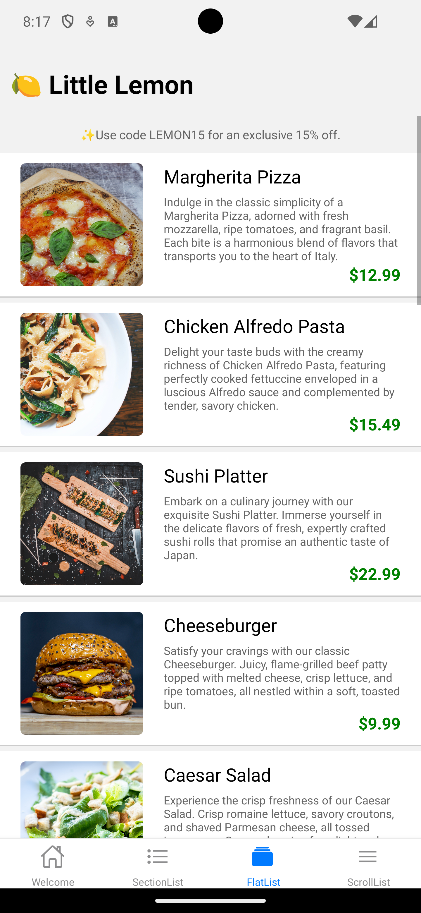

# Little Lemon Restaurant App - React Native

Little Lemon Restaurant App is a mobile application developed with React Native, offering a user-friendly interface to explore and discover the delectable offerings of Little Lemon Restaurant. The app highlights the implementation of the FlatList component for an optimized and smooth scrolling experience.

## Table of Contents

- [Features](#features)
- [Installation](#installation)
- [Usage](#usage)
- [Screenshots](#screenshots)
- [License](#license)

## Features

- **Menu Display**: Browse through the restaurant's menu with a dynamically generated list using FlatList.
  
- **Smooth Scrolling**: Enjoy a seamless scrolling experience, enhancing user engagement and satisfaction.
  
- **FlatList Implementation**: Utilizes React Native's FlatList for efficient rendering of lists, providing improved performance and responsiveness.
  
- **ScrollView Integration**: Seamlessly scroll through content using React Native's ScrollView component, offering a versatile and customizable scrolling experience.
  
- **SectionList Implementation**: Organize and present data in categorized sections with React Native's SectionList, providing a structured and intuitive user interface.

## Installation

1. Clone the repository:

   ```bash
   git clone https://github.com/vladimirkratinov/LittleLemonApp-ReactNative.git

2. Change into the project directory:

    ```bash
   cd LittleLemonApp-ReactNative

3. Install dependencies:

    ```bash
    npm install

## Usage

1. Run the app on an emulator or a physical device:

- Android:

    ```bash
    npx react-native run-android

- iOS:

   ```bash
    npx react-native run-ios

## Screenshots

**ver. 0.2.1 (12/15/2023)**
- add Feedback Screen

<div align="center">
   
   
</div>

**ver. 0.2 (12/14/2023)**
- add WelcomeScreen, SectionList, FlatList, ScrollView

<div align="center">
   
   
   <hr />
   
   
</div>

**ver. 0.1 (12/09/2023)**
- initial commit, ScrollView

<div align="center">
   
</div>

## License

[MIT License](https://opensource.org/licenses/MIT)
